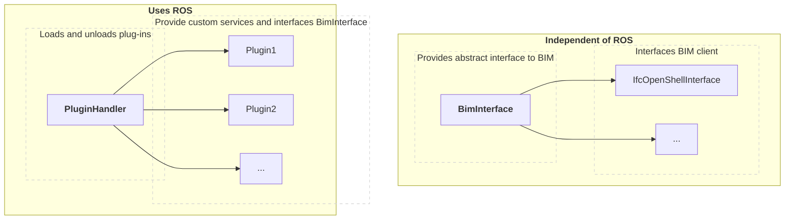

# ROSBIM - Package

Author(s): Tobit Flatscher, [Michael Terzer](mailto:michael.terzer@fraunhofer.it) and [Simone Garbin](mailto:simone.garbin@fraunhofer.it) (December 2021)

## Introduction to BIM

**Building Information models** (BIM) are used to plan, design, operate and maintain buildings and other infrastructures. Therefore they have to store very diverse information, ranging from purely geometric information to information about processes such as cost, manufacturer's details, sustainability or maintenance and timelines. A common open-source format are the [**Industry Foundation Classes** (IFCs)](https://en.wikipedia.org/wiki/Industry_Foundation_Classes), which are recognised by the ISO and is an official international standard, **ISO 16739**, since 2013. An overview on the object-based inheritance hierarchy of IFC can be found [here](https://publications.cms.bgu.tum.de/books/bim_2018/06_IFC_07.pdf).

## Description of the ROSBIM package

ROSBIM is a ROS package written in **Python** that allows an extraction of relevant information for a robot from a **Building Information Model (BIM)**. This information is accessed by certain functions of a library that are rendered available to the user of the Robot Operating System (ROS) via custom messages. In order to keep the code as modular as possible the ROS part is separated from the non-ROS part. The ROS part consists of several plug-ins that can be extended by creating an appropriate ROS package and a corresponding plug-in loader. The non-ROS part on the other hand is basically a library. Currently it only offers a single Industry Foundation Classes (IFC) back-end, based on [**IfcOpenShell**](http://ifcopenshell.org/python), but in the future it may be extended to use different other backends.

## Design goals

In the design process following design goals were considered:

- **Modular plug-in based architecture** in order to decrease the computational burden and increase extendibility
- **Separate non-ROS (library) and ROS code** such that a port to a newer version of ROS might be simply possible or that the underlying functions may be used outside of ROS
- Allow for **different BIM backends** in order to increase portability.

## Structure

The structure of the code was therefore chosen to consist of three main modules:

- The **plug-in handler** called `rosbim_manager`, which allows users to load plug-ins over a service request as well as selecting their back-end
- The **BIM interface** `bim_interface` with several potential back-ends such as the `ifcopenshell_interface`
- The different **plug-ins** that supply custom services and use the BIM interface in order to communicate (read and write) between the two worlds

