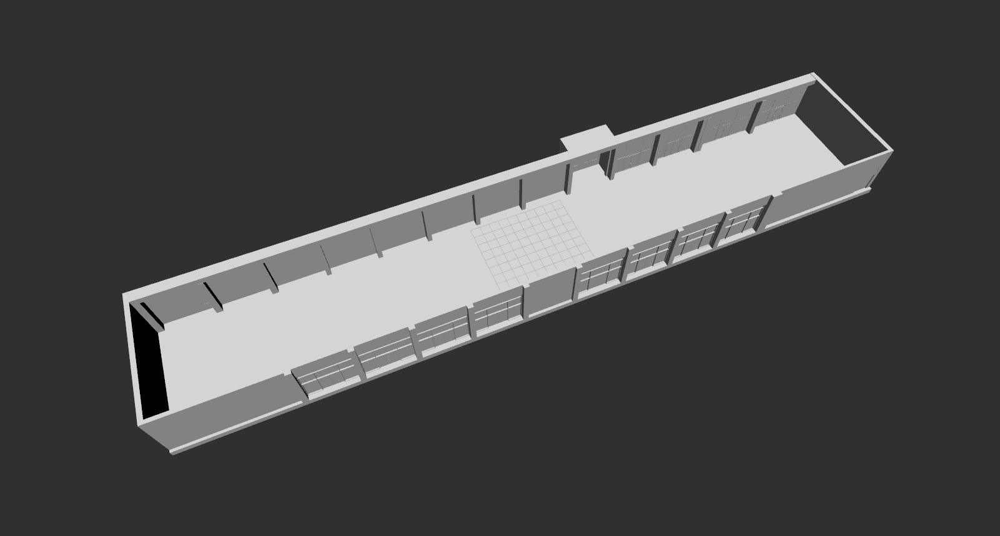

# ROSBIM Example Models

Author(s): Tobit Flatscher (2022)

## Description

This package contains BIM example geometries and launch files for launching a ROSBIM manager with the corresponding geometry loaded, e.g.

```bash
$ ros2 launch rosbim_example_models crane_hall_v10.launch.py
```

Additionally, the ROSBIM export map plugin is loaded and can be used to export an Occupancy Grid Map for navigation purposes. The nav2_map_server is launched as well in order to publish a map that can be visualized in the RViz2 window that is launched at the end. After the RViz2 window is launched, call:

```
ros2 lifecycle set /map_server configure
```

to configure the map_server, and then:

```
ros2 lifecycle set /map_server activate
```

To activate the map_server.

## Available geometries

### Crane Hall

The crane hall is located at the Fraunhofer Italia - IEC headquarters in the NOI Techpark, Bolzano (Italy).

```bash
$ ros2 launch rosbim_example_models crane_hall_v10.launch.py
```


