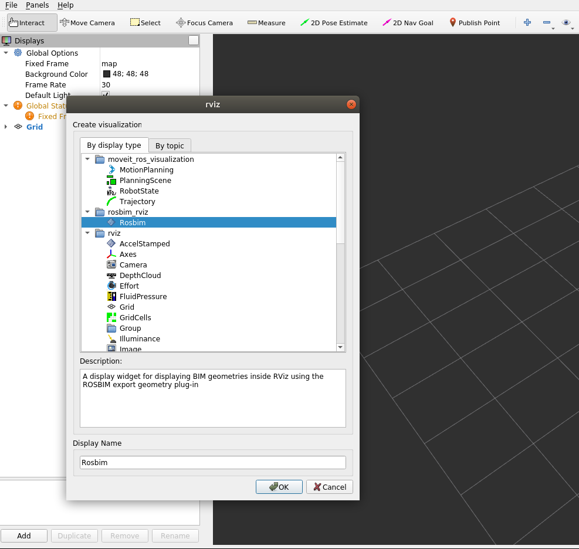
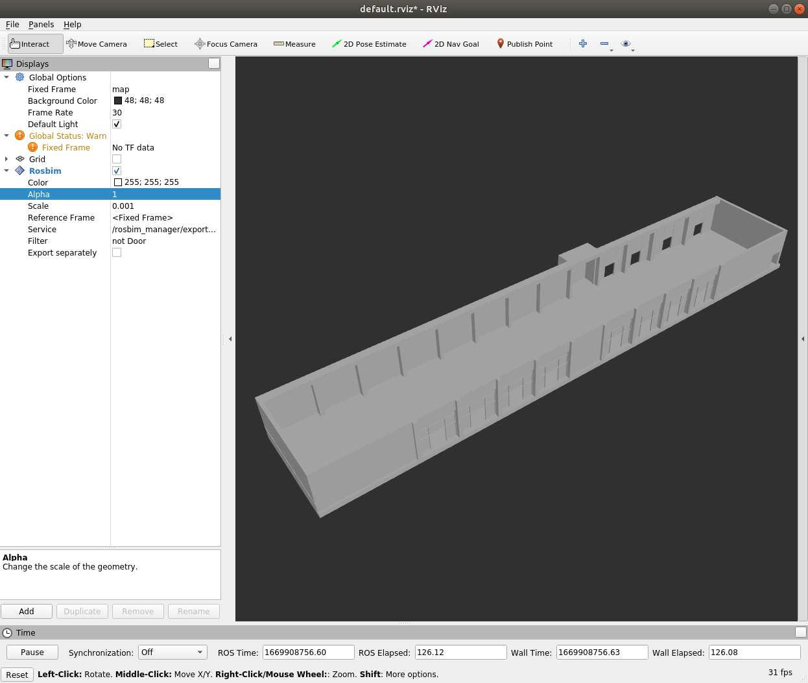
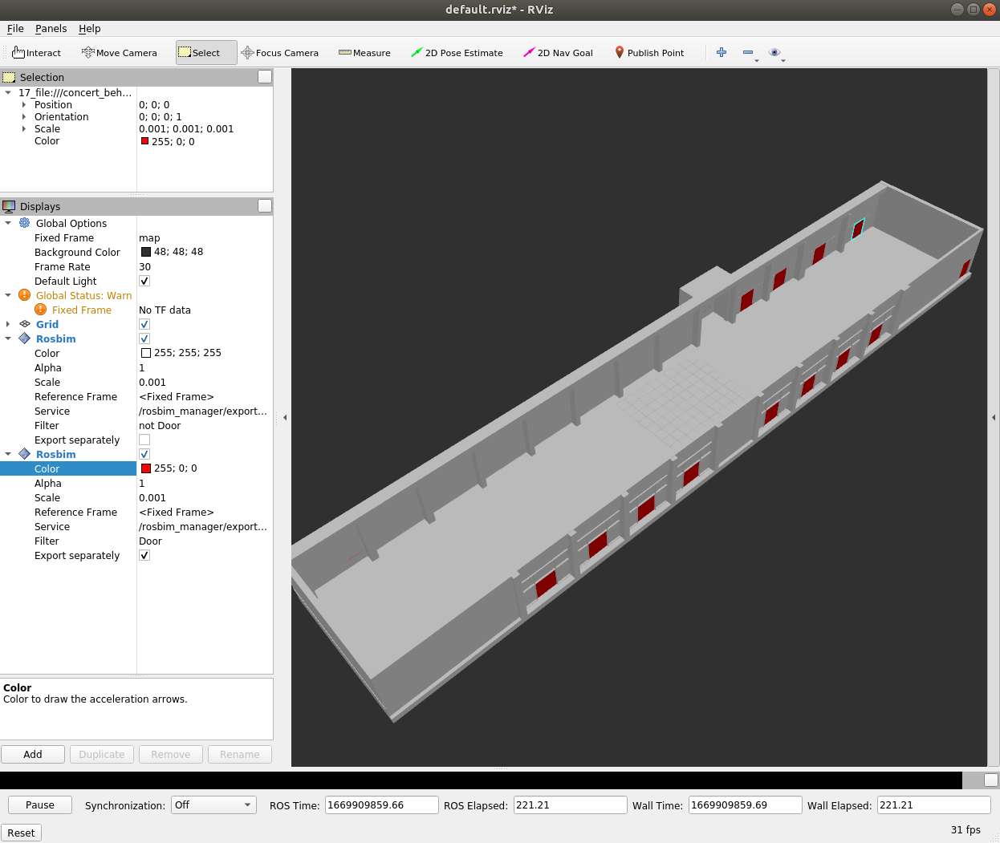

# rosbim_rviz - Package

Author(s): Tobit Flatscher (November-December 2022)

## Description

This package allows **ROSBIM to be integrated into an RViz visualization**. This way the geometry and selected semantic information might be visualized inside RViz and interacted with. This is done by contacting the corresponding ROSBIM export geometry plug-in for the geometry and exposing selected items over a topics that might be accessed by other ROS nodes.

Open RViz e.g. with `$ ros2 run rviz rviz` and under the display tab select `Add` on the bottom left. Then under the display type select the package name `rosbim_rviz` and then `Rosbim` as shown in the screenshot below:

You can then proceed to select the visualization, selecting color and alpha (transparency), as well as scaling the spawned mesh model. If multiple reference frames are available you may also change the reference frame of the model.

Under the service the available services of the type `rosbim_export_geometry_plugin/ExportGeometry` might be selected. If none is available you will have to launch ROSBIM and load the corresponding `ExportGeometry` plug-in, e.g. by launching `$ roslaunch rosbim_export_geometry_plugin export_geometry_plugin.launch`.

The filter allows to filter the components to be visualized. Permitted filters are expressions such as `Door` or `not Door`. Finally you can decide whether to use a single model for exporting the result of the query (default), which is significantly faster or exporting all components individually to different models. Depending on this choice you might be able to select every single component or only select the resulting model as a whole.

You might also add multiple ROSBIM plug-ins, e.g. one where only the doors are displayed and another one holding everything but the doors and assign different colors to them as displayed below:

When clicking on the different objects you will get the feedback specified in the `MeshSelectionHandler` in the selection tab as can be seen in the image above
